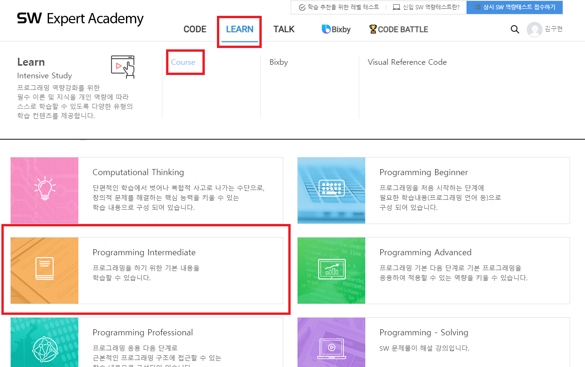

# List I

| No.  | Title               | Directory             | ºñ°í  |
| ---- | ------------------- | --------------------- | ----- |
|      | 4828_min_max        | `4828_min_max`        | learn |
|      | 4831_electric_bus   | `4831_electric_bus`   | learn |
|      | 4834_cards          | `4834_cards`          | learn |
|      | 4835_sumofintervals | `4835_sumofintervals` | learn |
|      | 1208_flatten        | `1208_flatten`        | HW    |

### [Learn Course](https://swexpertacademy.com/main/learn/course/subjectDetail.do?courseId=AVuPDN86AAXw5UW6&subjectId=AWOVFCzaqeUDFAWg)

### [HomeWork - 1208_flatten](https://swexpertacademy.com/main/code/problem/problemDetail.do?contestProbId=AV139KOaABgCFAYh&categoryId=AV139KOaABgCFAYh&categoryType=CODE&problemTitle=flatt&orderBy=FIRST_REG_DATETIME&selectCodeLang=ALL&select-1=&pageSize=10&pageIndex=1)

### extra.

- 1945 ??? ??? ??
- 5789 ??? ?? ???
- 6485 ???? ????
